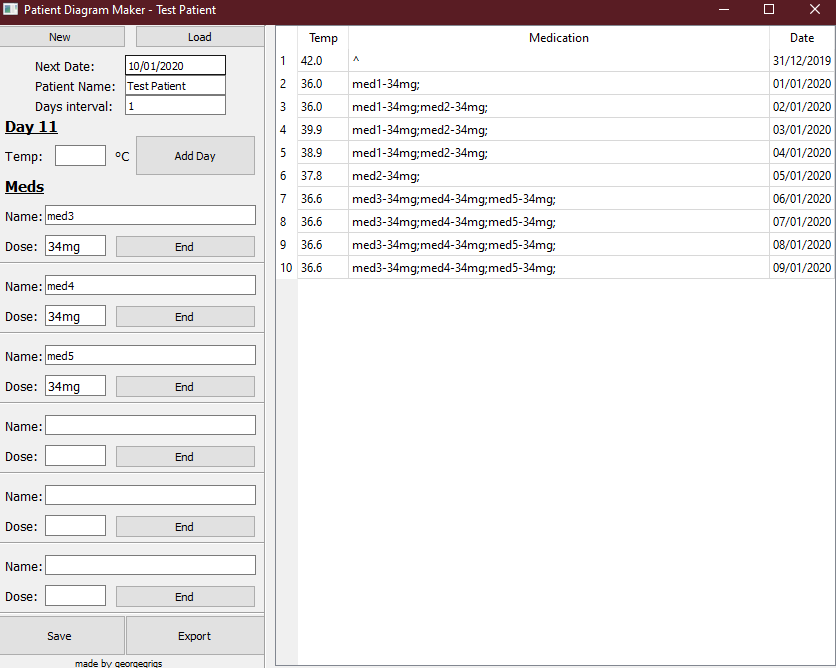
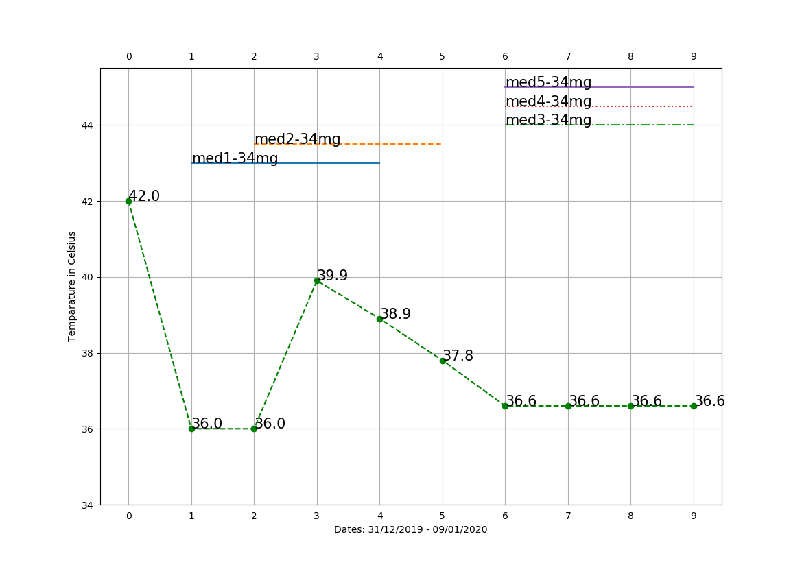

# Patient Diagram Maker

A Temparature-day-medication diagram maker that can be used to visualise data.

# Installation 

Install dependacies on the main.py
The exemaker.bat can be used to create an exe (you need pyinstaller installed)

# This project will not be maintaned at all
